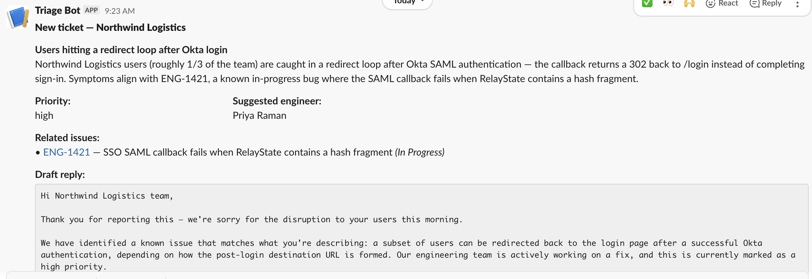

## The problem

CSMs at data platforms field a steady stream of customer tickets, and the first 5 minutes of triage are always the same: "is this a known engineering issue, and if so, who owns it?" That manual lookup happens hundreds of times a week across a CS team. This agent does that lookup automatically — searching an engineering issue tracker for related work, drafting a contextual customer reply, and routing both to Slack with the likely owning engineer named.

# AI Support Triage

Serverless agent that triages incoming support tickets with Claude. When a new
ticket lands in a support platform, a webhook fires a Lambda that uses Claude
(Sonnet 4.6) with tool use to search an engineering issue tracker for related
work, draft a customer reply, and post the result to Slack.

> **Note on this repo.** This is an anonymized portfolio version of a personal
> tool I built around a real support workflow. The repo keeps
> the architectural shape while replacing company-specific systems with generic
> support-ticket and issue-tracker adapters. The demo runs against a local mock
> and fixture webhook payloads so reviewers can read the code without
> provisioning accounts. See
> [ARCHITECTURE.md](./ARCHITECTURE.md) for the deployment-vs-demo split.

## What it does

```
Support ticket created
        │
        ▼
API Gateway ── POST /support/webhook ──▶ Lambda (handler.py)
                                         │
                                         ├─ Claude w/ tool use
                                         │    ├─ search_issues  (tool)
                                         │    └─ submit_triage  (tool)
                                         │
                                         └─ Slack incoming webhook
```

A typical run cuts the manual "is this already a known issue?" search from a
few minutes to a few seconds, and surfaces the most likely owning engineer so
the on-call CSM knows who to ping.

## Example output

For the fixture ticket [`sso_redirect_loop.json`](./fixtures/tickets/sso_redirect_loop.json)
(*"Users hitting a redirect loop after Okta login"*), the agent searches the
issue tracker, finds the matching in-progress engineering issue, and posts to
Slack:



## Running it locally

```bash
python3.11 -m venv .venv && source .venv/bin/activate
pip install -r requirements.txt
cp .env.example .env       # then fill in ANTHROPIC_API_KEY

# Terminal 1 — start the issue tracker mock
uvicorn mocks.issue_tracker_server:app --port 8765

# Terminal 2 — run the handler against a fixture
python -m scripts.run_local fixtures/tickets/sso_redirect_loop.json
```

Without a `SLACK_WEBHOOK_URL` set, the formatted message prints to stdout so
the demo is fully self-contained.

## Tests

```bash
pytest
```

The tests stub the Anthropic client with a scripted tool-use sequence — no API
key required.

## Deploying to AWS

The Lambda + API Gateway wiring lives in [`infra/template.yaml`](./infra/template.yaml)
(AWS SAM). A real support-platform integration is just configuring the deployed
URL as a ticket-created webhook target.

```bash
sam build -t infra/template.yaml
sam deploy --guided
```

## Project layout

| Path | What's in it |
| --- | --- |
| `src/triage/handler.py` | Lambda entry point — parses webhook, runs triage, posts to Slack |
| `src/triage/triage.py` | Claude tool-use loop (`search_issues` + `submit_triage`) |
| `src/triage/issue_tracker_client.py` | Issue tracker GraphQL client; same code path against real or mock |
| `src/triage/slack_client.py` | Slack block-kit poster with stdout fallback |
| `src/triage/models.py` | Pydantic models for ticket + triage result |
| `mocks/issue_tracker_server.py` | FastAPI mock returning realistic issue-search results |
| `infra/template.yaml` | SAM template for Lambda + API Gateway |
| `fixtures/tickets/` | Sample support-ticket webhook payloads |

## Design notes

- **Prompt caching** on the system prompt — most of the cost per ticket is the
  same system text, so caching cuts both latency and spend.
- **Forced structured output via `submit_triage`** rather than parsing free-form
  text. The loop ends only when the model calls the submit tool, so the
  output shape is guaranteed.
- **No invented issue tickets** — the model is instructed to only reference
  identifiers returned by the search tool, and the loop double-checks by
  joining returned issues to the tool-call history before persisting.
- **Bounded turns** (`MAX_TURNS = 6`) — caps cost on pathological inputs.
